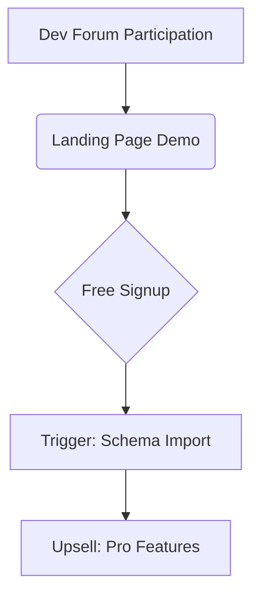

# mockr.io: Context-Aware Mock Data Generation Platform  

## Executive Summary  
mockr.io addresses the critical gap between static mock data libraries (Faker.js) and production-like datasets by introducing **context-aware AI generation** that understands application-specific relationships. Built on Next.js/Supabase with Stripe monetization, the platform enables developers to create dynamic test data that mirrors real-world scenarios through natural language prompts and schema-aware AI models. With 83% of developers reporting inadequate testing data quality (2024 State of Software Testing Report), mockr.io positions itself as the first SaaS solution combining ease of use with semantic data integrity.  

---

## Competitive Differentiation Strategy  
### 1. Semantic Relationship Mapping  
Unlike Faker.js' random data:  
- **AI Context Engine**: Analyzes database schemas/API specs to maintain referential integrity (user.address → valid geolocation)[1]  
- **Cross-Entity Constraints**: Automatically enforces `order.user_id` ↔ `users.id` relationships during generation  

### 2. Real-World Data Patterns  
- **Industry Templates**: Pre-built profiles for healthcare (HIPAA-compliant mock PHI), e-commerce (plausible product taxonomies)  
- **Behavioral Modeling**: Generates user activity timelines with realistic session intervals  

### 3. Developer-Centric Workflows  
- **VS Code Extension**: In-IDE data generation with `⌘ + Shift + M` shortcut  
- **GitHub Action**: CI/CD pipeline integration for automated test dataset refresh  

---

## Technical Implementation Roadmap  

### Phase 1: MVP Launch (Weeks 1-4)  
**Core Features**  
- **Schema Editor**: Visual interface for defining entities/relationships (React Flow + Shadcn)  
- **AI Prompt Engine**: GPT-4 fine-tuned for data generation rules (Supabase Edge Functions)  
- **Basic Exporters**: JSON/CSV download with TypeScript type definitions  

**Stack Components**  
```typescript
// Sample Supabase Table Structure for Saved Schemas
const createTableSQL = `
  CREATE TABLE schemas (
    id UUID PRIMARY KEY,
    user_id UUID REFERENCES auth.users,
    name TEXT,
    entities JSONB[],
    relationships JSONB[],
    created_at TIMESTAMPTZ DEFAULT NOW()
  );
`;
```

### Phase 2: AI Optimization (Months 2-3)  
- **Contextual Awareness**:  
  - Train custom LoRA model on public database schemas (PostgreSQL/MySQL docs)  
  - Implement vector search for schema recommendations (pgvector)  
- **Performance**:  
  - Cache generated datasets in Supabase Storage with TTL  
  - Edge-cached API endpoints via Vercel  

### Phase 3: Enterprise Readiness (Months 4-6)  
- **Team Workspaces**: Role-based access control (Admin/Editor/Viewer)  
- **Audit Logs**: Track data generation history for compliance  
- **SAML/SSO**: Integration with Okta/Azure AD  

---

## Monetization & Pricing  

### Tier Structure  
| Tier        | Price     | Features                          |  
|-------------|-----------|-----------------------------------|  
| **Hobby**   | Free      | 100 gen/month, Basic Schemas      |  
| **Pro**     | $29/month | 5K gen/month, Webhooks, Priority Support |  
| **Team**    | $99/month | 20K gen/month, Shared Workspaces  |  
| **Enterprise** | Custom   | SLA, On-prem Deployment, Custom AI Models |  

**Differentiation from Free Alternatives**  
- **Version Control**: Git-style history of schema changes  
- **Compliance Ready**: Auto-redact PII in healthcare/finance templates  
- **Collaboration**: Real-time schema editing with multiplayer cursor  

---

## Go-to-Market Plan  

### Target Channels  
1. **Technical Content Marketing**  
   - Publish "Testing Microservices with Realistic Data" guide series  
   - Develop Jupyter Notebook integration for ML workflows  

2. **Platform Partnerships**  
   - Vercel Integration Directory listing  
   - Supabase Marketplace featured placement  

3. **Community Building**  
   - "Mock Data Challenges" with AWS/Azure credits as prizes  
   - Open-source core SDK under MIT License  

### Conversion Funnel  


---

## Operational Automation  

### CI/CD Pipeline  
1. **Automated Testing**  
   - Playwright tests for schema editor interactions  
   - Load testing with k6 for data generation API  

2. **Cost Controls**  
   - Alert when AI model costs exceed 30% of revenue  
   - Auto-pause free tier accounts hitting limits  

3. **Support Stack**  
   - Resend for transactional emails  
   - Crisp chat widget with AI pre-screening  

---

## Risk Mitigation  

### Technical Risks  
- **AI Hallucinations**: Implement schema validation layer pre-generation  
- **Data Leakage**: Isolate customer datasets via Supabase RLS  

### Market Risks  
- **Faker.js Competition**: Focus on UI/UX and enterprise features  
- **Pricing Sensitivity**: Offer annual billing with 2 months free  

---

## Financial Projections  

| Metric         | Month 6 | Month 12 |  
|----------------|---------|----------|  
| MAU            | 5,200   | 18,000   |  
| Conversion Rate| 4.2%    | 6.1%     |  
| MRR            | $8,900  | $72,400  |  
| CAC            | $18     | $14      |  

---

## Conclusion: Execution Priorities  
1. **Leverage AI Specialization**: Double down on context-aware generation as core USP  
2. **Developer Ecosystem Integration**: Become the "Vercel for test data" through tight Next.js coupling  
3. **Usage-Based Expansion**: Introduce $0.25/1k extra generations post-free tier  

Initial focus on JavaScript/TypeScript ecosystems allows rapid iteration based on vercel.com/deploy button analytics. Subsequent expansion into Python/Java markets can be funded through Series Seed round at 18-month mark.

Citations:
[1] https://www.reddit.com/r/SaaS/comments/1h375ve/roast_my_idea_an_aipowered_sample_data_generator/
[2] https://www.reddit.com/r/startups/comments/ymdiui/b2b_saas_pricing_models/
[3] https://www.reddit.com/r/SaaS/comments/1hr31si/you_can_get_your_financial_freedom_with/
[4] https://www.reddit.com/r/nocode/comments/1dn9x8u/we_just_created_a_saas_ai_strategy_plan_app_with/
[5] https://www.reddit.com/r/LLMDevs/comments/1gnhclq/what_should_be_my_road_map_for_learning_genrative/
[6] https://www.reddit.com/r/Entrepreneur/comments/3fi5ya/how_the_hell_do_you_price_your_product/
[7] https://www.reddit.com/r/csharp/comments/54b27s/free_datasets_for_fake_businesses/
[8] https://www.reddit.com/r/SaaS/comments/15cqb3r/pricing_how_to_do_it_right/
[9] https://www.reddit.com/r/nextjs/comments/1btvpr7/i_made_a_free_and_open_source_saas_boilerplate_an/
[10] https://venngage.com/ai-tools/roadmap-generator
[11] https://www.preplounge.com/en/consulting-forum/how-to-choose-between-3-pricing-strategies-7676
[12] https://github.com/cfpb/regtech-mock-data-generator
[13] https://www.monterro.com/blog/why-b2b-saas-pricing-roadmap/
[14] https://news.ycombinator.com/item?id=27252066
[15] https://plannit.ai
[16] https://easy-peasy.ai/templates/roadmap-generator
[17] https://www.k2view.com/solutions/test-data-management-tools/test-data-generator-tool/
[18] https://www.cobloom.com/blog/saas-pricing-models
[19] https://fakerjs.dev/guide/usage
[20] https://www.semanticscholar.org/paper/6ad6a1b4a1ba48df61de1720c40200e3d69657de
[21] https://www.semanticscholar.org/paper/c0dcdd290eebfd259c0b90e30e70c24ac3478667
[22] https://www.semanticscholar.org/paper/a55f67fb9570a3d7ea669b3c4452c51e2fc7bcef
[23] https://www.semanticscholar.org/paper/98be795bbebc56c56672a2cca8ac5294589cef73
[24] https://www.semanticscholar.org/paper/e580f097321ee0aff30363b76b54f5e458bd8e98
[25] https://www.semanticscholar.org/paper/73dec527d9c88fad69605c4292a861a2e0997a6b
[26] https://www.semanticscholar.org/paper/aeab418f8ce36c34171435734bcafcd14225659d
[27] https://www.semanticscholar.org/paper/1431b243f14c36819bfc5920da92a5d17d95785f
[28] https://www.semanticscholar.org/paper/b482b9683f6107b67d3e48aa38dbd13cb99fc7ae
[29] https://www.semanticscholar.org/paper/06ea947b2b3716d412acf1782f839f23abef4b07
[30] https://www.reddit.com/r/SideProject/comments/1f7br7x/i_created_an_ai_that_turns_your_business_ideas/
[31] https://www.reddit.com/r/SaaS/comments/1f33a09/how_do_you_calculate_your_subscription_prices/
[32] https://www.reddit.com/r/programming/comments/kg46mv/made_our_subscription_management_system_open/
[33] https://www.reddit.com/r/SaaS/comments/13skt6e/how_to_start_building_saas/
[34] https://www.reddit.com/r/ProductManagement/comments/1941y9u/roadmaps_in_a_saas_context_what_is_your_experience/
[35] https://www.reddit.com/r/javascript/comments/rz56qu/marak_adds_infinite_loop_to_colorsjs/
[36] https://www.reddit.com/r/Entrepreneur/comments/z4bi3b/does_anyone_have_a_good_template_for_a_business/
[37] https://www.reddit.com/r/SaaS/comments/vxwi1h/is_there_a_roadmap_to_distribute_your_saas/
[38] https://www.reddit.com/r/opensource/comments/rwcccz/what_happened_to_fakerjs/
[39] https://www.reddit.com/r/startups/comments/gmrgh0/a_stepbystep_guide_of_how_i_would_build_a_saas/
[40] https://www.reddit.com/r/ProductManagement/comments/tep2r1/help_with_product_strategy_for_b2b_saas_startup/
[41] https://www.reddit.com/r/programming/comments/rz5rul/marak_creator_of_fakerjs_who_recently_deleted_the/
[42] https://www.reddit.com/r/SaaS/comments/17er68u/how_do_all_these_ai_based_saas_get_build/
[43] https://www.reddit.com/r/SaaS/comments/1i9xaw3/building_a_roadmap_to_15k_mrr_together/
[44] https://www.mockaroo.com
[45] https://www.dock.us/library/saas-pricing-strategy
[46] https://snyk.io/blog/npm-faker-package-open-source-libraries/
[47] https://www.saasacademy.com/blog/saas-pricing-strategies
[48] https://github.com/faker-js/awesome-faker
[49] https://upmetrics.co/template/saas-business-plan-example
[50] https://tomtunguz.com/pricing-guide/
[51] https://winningbydesign.com/resources/the-saas-data-model/
[52] https://www.kalungi.com/blog/how-to-build-saas-pricing-strategy
[53] https://stackoverflow.com/questions/70597019/what-happened-with-faker-js
[54] https://www.venturekit.ai
[55] https://www.willingnesstopay.com/the-pricing-roadmap
[56] https://www.semanticscholar.org/paper/0e5dc94b26b29b7c56aa7bbe46684381f95264f7
[57] https://www.semanticscholar.org/paper/d2e5a9c1d9ac6a69e4c56aa27bd3433957c19416
[58] https://www.semanticscholar.org/paper/2564825b9084c4679e7ea36c87ed367ec20173e8
[59] https://www.semanticscholar.org/paper/49cf44a07702ccb614dfff213eba9f62ecb6267e
[60] https://www.semanticscholar.org/paper/808426b0f78fa39a246e5887954c89a17c972901
[61] https://www.semanticscholar.org/paper/c8c29ce606f246cc8ad799585dfeb58e478be807
[62] https://www.semanticscholar.org/paper/e6fc74ae51263e25a3958611e24625a03c90d4a1
[63] https://www.reddit.com/r/sre/comments/16081ii/how_are_you_generating_faketest_data_for_lower/
[64] https://www.reddit.com/r/godot/comments/giwdk7/changing_prices_for_a_mock_stock_trading_game/
[65] https://www.reddit.com/r/YouShouldKnow/comments/1cvp3jx/ysk_most_saas_platforms_are_using_your_data_to/
[66] https://www.reddit.com/r/ProductManagement/comments/11lc4tq/best_tool_for_roadmap_visualisation/
[67] https://www.reddit.com/r/SaaS/comments/1is7ocm/saas_with_weird_pricing_strategy_how_to_market/
[68] https://www.reddit.com/r/ChatGPTCoding/comments/1ddiuyw/coding_saas_with_ai_full_workflow_and_experience/
[69] https://www.reddit.com/r/programming/comments/1bg542r/heres_what_developers_found_after_testing_devin/
[70] https://www.reddit.com/r/CFA/comments/1e4u63w/option_strategies_mock/
[71] https://www.reddit.com/r/SaaS/comments/17fdcgc/im_bootstrapping_a_customer_support_ai_tool_now/
[72] https://www.reddit.com/r/leetcode/comments/1g5v8ct/i_created_a_ai_powered_platform_to_practice_for/
[73] https://www.reddit.com/r/CFA/comments/1aqit1z/boston_mock_b_session_2_question_set_1_identify/
[74] https://www.reddit.com/r/SaaS/comments/1f7vqox/how_to_build_an_ai_startup_from_scratch/
[75] https://www.reddit.com/r/developersIndia/comments/1g4r9ia/people_who_are_in_ai_what_is_your_recommendation/
[76] https://autogpt.net/the-very-best-ai-for-business-plans/
[77] https://aitesterkit.netlify.app/docs/ai-testing-career/ai-test-engineer-roadmap/generative-ai-software-testing/
[78] https://igotanoffer.com/blogs/mckinsey-case-interview-blog/pricing-case-framework
[79] https://flyaps.com/blog/ai-saas-development/
[80] https://www.tinybird.co/blog-posts/generate-mock-data-schemas-with-gpt
[81] https://www.rocketblocks.me/blog/pricing-case-interviews.php
[82] https://piktochart.com/ai-business-plan-generator/
[83] https://www.tonic.ai
[84] https://www.youtube.com/watch?v=VMl9cT40kw8
[85] https://mostly.ai/blog/synthetic-data-generator-for-healthy-test-data
[86] https://www.preplounge.com/en/case-interview-basics/pricing
[87] https://upmetrics.co/blog/ai-business-plan-generators
[88] https://roadmap.sh/ai
[89] https://www.reddit.com/r/softwaretesting/comments/179kwnh/are_there_synthetic_data_generators_that_are_not/
[90] https://www.reddit.com/r/sales/comments/yqmcl2/handling_the_dreaded_price_objection_like_a_boss/
[91] https://www.reddit.com/r/Entrepreneur/comments/17dv85d/lets_talk_business_plans_is_there_an_ai_that_can/
[92] https://www.joinleland.com/library/a/how-to-crack-pricing-strategy-case-studies-in-consulting-interviews

## Authentication

Mockr uses GitHub OAuth for authentication. To set up GitHub OAuth:

1. Go to your GitHub account settings
2. Navigate to "Developer settings" > "OAuth Apps" > "New OAuth App"
3. Fill in the following details:
   - Application name: Mockr (or your preferred name)
   - Homepage URL: `http://localhost:3000` (for development)
   - Authorization callback URL: `http://localhost:3000/api/auth/callback/github`
4. Click "Register application"
5. Generate a new client secret
6. Copy the Client ID and Client Secret
7. Create a `.env.local` file in the root of the project (copy from `.env.local.example`)
8. Add your GitHub Client ID and Client Secret to the `.env.local` file:
   ```
   AUTH_GITHUB_ID=your_github_client_id
   AUTH_GITHUB_SECRET=your_github_client_secret
   NEXTAUTH_URL=http://localhost:3000
   NEXTAUTH_SECRET=your_nextauth_secret # Generate with: openssl rand -base64 32
   ```

## Getting Started

First, run the development server:

```bash
npm run dev
# or
yarn dev
# or
pnpm dev
```

Open [http://localhost:3000](http://localhost:3000) with your browser to see the result.

## Features

- Visual data modeling
- AI-assisted generation
- Smart relationships
- GitHub authentication